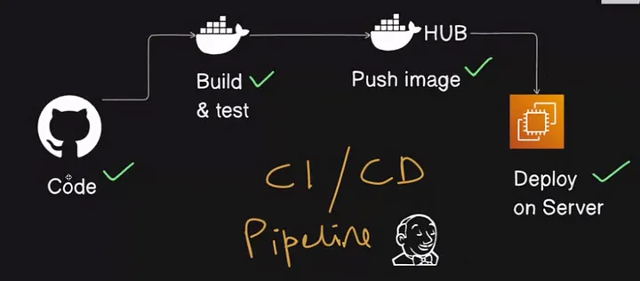
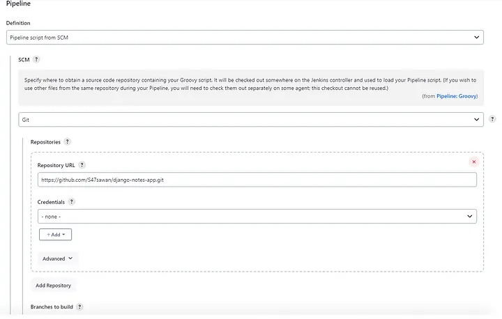
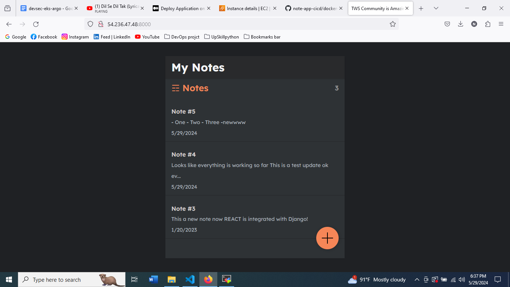

# DevSecOps Project : React-drf Notes App
This is a simple notes app built with React and Django rest freamwork.This app deploy on aws ec2 using jenkind ci/cd decliarative pipline

### DevSecOps Project Diagram:


## Requirements
1. Python
2. Node.js
3. React

## Tools Used:
* AWS Account
* Jenkins
* Github
* SonarQube
* Trivy
* Docker & Dockerhub

### Step 1: IAM Configuration
- create IAM user `user` with administration access.
- Generate Security Credentials: Access Key and Secret Access Key.

### Step 2: EC2 Setup
- Launch a t2 medium Ubuntu instance in a favourite region (eg. region `us-east-1`).
-  sg expose port 8080,8000,3000, as port for Jenkins backend and frontend react.
- SSH into the instance from your local machine.

### Step 3: clone repo
```shell
git clone https://github.com/nusratdevo/note-app-cicd
```

### Step 4: install tools
- make file executable and Run the file
``` shell 
chmod +x tools-install.sh
./tools-install.sh
```
### Step 5: check every tools install successfully
``` shell
jenkins --version
docker --version
docker ps
trivy --version
```

### Step 6: Open jenkins in browser, login and install tools
``` shell
Open jenkins on port <EC2 Public_IP>:8080
administrative password : sudo cat /var/lib/jenkins/secrets/initialAdminPassword
```

### step 7: Set up Docker Hub credentials:
- Goto Jenkins Dashboard → Manage Jenkins → Credentials → system → Global credentials (unrestricted)→ Add username with password.
- kind(username with password)->username(dockerhub username)->password(dockerhub pass)->Id(dockerHub)

### step 8: Using Webhook to Automate the CI/CD pipeline:
To automate the CI/CD pipeline I will set up a Webhook.
- In the Github, click on settings. On the next page, left-hand panel click on webhooks. Next, click on Add Webhook.
- playloadURL Jenkins URL appendas like ` <public_ip:8080>/github-webhook/`
- Click on the green button that says “Add webhook”
-In the Configuration for the script, select pipeline script from SCM (Source Code Management).
Provide the GitHub repo URL.
-Now any time a change is committed to GitHub, the pipeline will automatically be triggered.


### Steps 9: build now

## Nginx

Install Nginx reverse proxy to make this application available

`sudo apt-get update`
`sudo apt install nginx`
